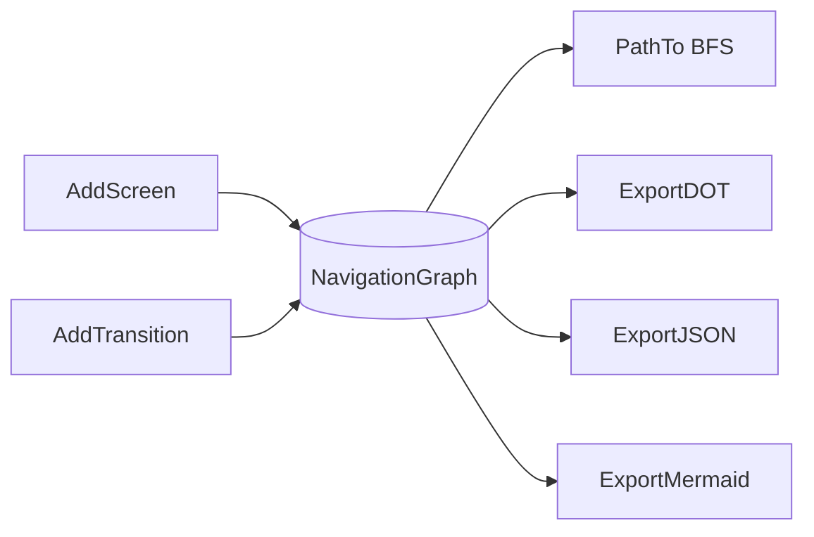
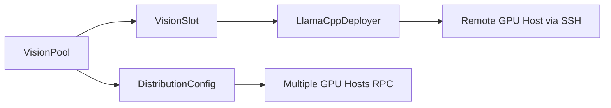
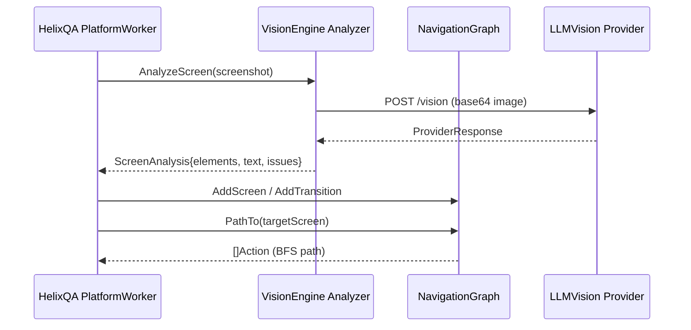

# VisionEngine Architecture

**Module:** `digital.vasic.visionengine`

VisionEngine provides computer vision and LLM Vision capabilities for UI analysis
and navigation graph building. It is consumed by HelixQA autonomous sessions for
screen analysis, element detection, and app navigation tracking.

---

## Package Overview

| Package | Role |
|---------|------|
| `pkg/analyzer` | Core interfaces and shared types |
| `pkg/graph` | NavigationGraph with BFS pathfinding and export |
| `pkg/llmvision` | LLM Vision API adapters (pure Go HTTP) |
| `pkg/opencv` | OpenCV integration (stub by default; real impl behind `vision` build tag) |
| `pkg/config` | Configuration from environment variables |
| `pkg/remote` | Multi-instance vision inference pool management for remote GPU hosts |
| `pkg/i18n` | Minimal dependency-free `Translator` interface for message localization |

---

## Analyzer Interface

`pkg/analyzer` defines the central contract:

```go
type Analyzer interface {
    AnalyzeScreen(ctx context.Context, screenshot []byte) (ScreenAnalysis, error)
    CompareScreens(ctx context.Context, before, after []byte) (ScreenDiff, error)
    DetectElements(screenshot []byte) ([]UIElement, error)
    DetectText(screenshot []byte) ([]TextRegion, error)
    IdentifyScreen(ctx context.Context, screenshot []byte) (ScreenIdentity, error)
    DetectIssues(ctx context.Context, screenshot []byte) ([]VisualIssue, error)
}
```

Key types:

| Type | Description |
|------|-------------|
| `UIElement` | Detected widget with bounding box, type, and confidence |
| `ScreenAnalysis` | Full analysis result: elements, text, layout hash, description |
| `ScreenDiff` | Pixel-level diff between two frames |
| `VisualIssue` | Anomaly with category (visual/UX/accessibility/functional) and severity |

Concrete implementations satisfy this interface: `StubAnalyzer` (delegates to
`pkg/llmvision`) and the OpenCV-backed analyzer (delegates to `pkg/opencv`, requires build
tag `vision`).

---

## NavigationGraph

`pkg/graph.NavigationGraph` is the most-imported package — HelixQA's autonomous
session uses it to record and replay app navigation paths.



- **Nodes** are `ScreenIdentity` values (ID, Name, optional metadata).
- **Edges** are `Action` values (type, target, optional payload) with a source and
  destination screen ID.
- **BFS pathfinding** (`PathTo`) returns the shortest action sequence from the
  current screen to a target screen, enabling the autonomous navigator to reach
  any known screen deterministically.
- Thread safety is provided by `sync.RWMutex`; read paths (`PathTo`, exports) use
  `RLock`, write paths (`AddScreen`, `AddTransition`, `SetCurrent`) use `Lock`.

---

## LLM Vision Providers

`pkg/llmvision` implements the `VisionProvider` interface over pure Go HTTP calls
(no CGo dependency):

```
VisionProvider interface
  ├─ OpenAIProvider    (GPT-4o vision endpoint)
  ├─ AnthropicProvider (Claude vision messages API)
  ├─ GeminiProvider    (Gemini Pro Vision API)
  ├─ QwenProvider      (Qwen-VL API)
  ├─ OllamaProvider    (Ollama local vision API)
  ├─ KimiProvider      (Kimi vision API)
  ├─ AsticaProvider    (Astica vision API)
  └─ StepGUIProvider   (StepFun GUI vision API)
```

`FallbackProvider` wraps a priority-ordered list of providers and retries the next
provider on any error, giving multi-provider resilience without caller-side retry
logic.

All providers:
- Encode images as base64 in the request body.
- Validate image dimensions and byte size before sending.
- Return a description string with raw analysis from the provider.

---

## OpenCV Integration

`pkg/opencv` ships two implementations selected at compile time:

| Build | File | Behaviour |
|-------|------|-----------|
| Default | `stub.go` (`//go:build !vision`) | Returns `ErrOpenCVNotAvailable` for all calls |
| `vision` tag | `color_vision.go`, `detector_vision.go`, `differ_vision.go`, `factory_vision.go`, `video_vision.go` (`//go:build vision`) | Full GoCV SSIM, template matching, contour detection, color analysis, video processing |

Interfaces defined in `interfaces.go`:

| Interface | Description |
|-----------|-------------|
| `Differ` | SSIM, pixel diff, change mask between two images |
| `ElementDetector` | Edge detection, contour detection, template matching |
| `ColorAnalyzer` | Dominant color extraction, contrast ratio analysis |

The `factory.go` file provides `NewStubDiffer`, `NewStubElementDetector`,
`NewStubColorAnalyzer` for stub-mode construction. The `factory_vision.go` file
(build tag `vision`) provides `NewDiffer`, `NewElementDetector`, `NewColorAnalyzer`,
`NewVideoProcessor` backed by GoCV.

This approach keeps the module buildable and testable on any machine without OpenCV
installed while enabling full CV capabilities when GoCV is available.

---

## Remote Deployment

`pkg/remote` manages multi-instance vision inference pools on remote GPU hosts,
supporting both Ollama and llama.cpp backends.

### Key Types

| Type | Description |
|------|-------------|
| `VisionPool` | Pool of `VisionSlot` instances on a remote GPU host; manages slot assignment, SSH-backed lifecycle |
| `VisionSlot` | A single inference slot (backend + port) assigned to one device at a time |
| `LlamaCppDeployer` | Manages llama-server processes on a remote host via SSH (start, stop, GPU free/restore) |
| `SSHConfig` | SSH credentials and connection parameters for in-band process management |
| `DistributionConfig` | Configuration for distributed RPC across multiple GPU hosts |
| `PoolConfig` | Configuration for a `VisionPool` (host, backend type, port range) |
| `SlotTarget` | Target specification for slot assignment (device ID, preferred backend) |
| `LlamaCppConfig` | llama.cpp–specific configuration (model path, GPU layers, context size) |



`LlamaCppDeployer.FreeGPU` stops Ollama on the remote host to free VRAM for
llama-server instances. `LlamaCppDeployer.StartInstance` launches llama-server
at a given port. `LlamaCppDeployer.RestoreOllama` restarts Ollama after
llama-server instances are done.

`VisionPool.EnsureReady` validates configuration and (when `SSHConfig` is
provided) probes the remote backend for reachability. Callers that supply an
empty `SSHConfig.Host` receive `ErrBackendVerificationNotImplemented` and
MUST independently probe the backend (HTTP health-check or TCP dial).

---

## Data Flow: Autonomous QA Screen Analysis


