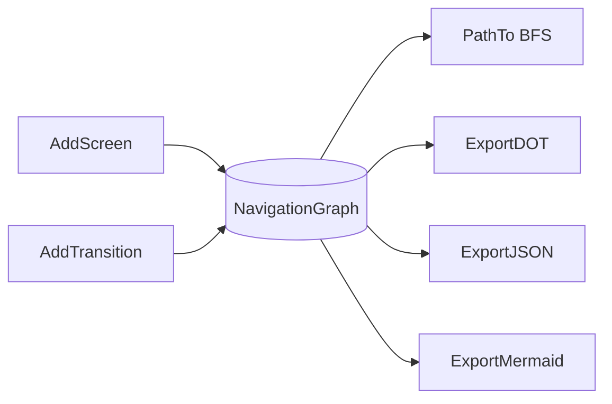
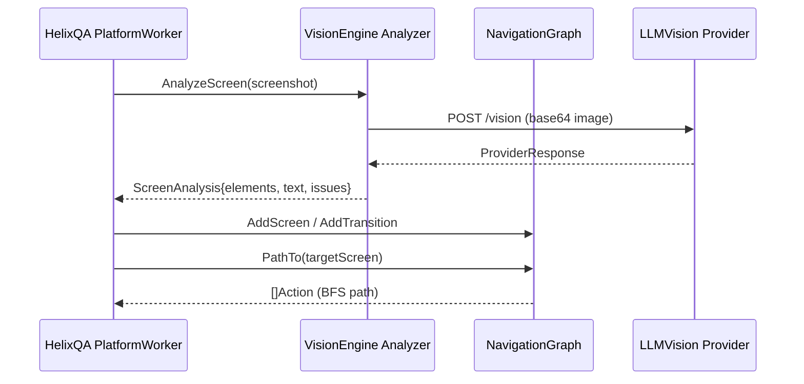

# VisionEngine Architecture

**Module:** `digital.vasic.visionengine`

VisionEngine provides computer vision and LLM Vision capabilities for UI analysis
and navigation graph building. It is consumed by HelixQA autonomous sessions for
screen analysis, element detection, and app navigation tracking.

---

## Package Overview

| Package | Role |
|---------|------|
| `pkg/analyzer` | Core interfaces and shared types |
| `pkg/graph` | NavigationGraph with BFS pathfinding and export |
| `pkg/llmvision` | LLM Vision API adapters (pure Go HTTP) |
| `pkg/opencv` | OpenCV integration (stub by default; real impl behind `vision` build tag) |
| `pkg/config` | Configuration from environment variables |

---

## Analyzer Interface

`pkg/analyzer` defines the central contract:

```go
type Analyzer interface {
    AnalyzeScreen(ctx context.Context, img Image) (*ScreenAnalysis, error)
    DetectElements(ctx context.Context, img Image) ([]UIElement, error)
    DetectText(ctx context.Context, img Image) ([]TextRegion, error)
    DetectIssues(ctx context.Context, before, after Image) ([]VisualIssue, error)
}
```

Key types:

| Type | Description |
|------|-------------|
| `UIElement` | Detected widget with bounding box, type, and confidence |
| `ScreenAnalysis` | Full analysis result: elements, text, layout hash, description |
| `ScreenDiff` | Pixel-level diff between two frames |
| `VisualIssue` | Anomaly with category (visual/UX/accessibility/functional) and severity |

Concrete implementations satisfy this interface: `LLMAnalyzer` (delegates to
`pkg/llmvision`) and `OpenCVAnalyzer` (delegates to `pkg/opencv`, requires build
tag `vision`).

---

## NavigationGraph

`pkg/graph.NavigationGraph` is the most-imported package — HelixQA's autonomous
session uses it to record and replay app navigation paths.



- **Nodes** are `ScreenIdentity` values (ID, Name, optional metadata).
- **Edges** are `Action` values (type, target, optional payload) with a source and
  destination screen ID.
- **BFS pathfinding** (`PathTo`) returns the shortest action sequence from the
  current screen to a target screen, enabling the autonomous navigator to reach
  any known screen deterministically.
- Thread safety is provided by `sync.RWMutex`; read paths (`PathTo`, exports) use
  `RLock`, write paths (`AddScreen`, `AddTransition`, `SetCurrent`) use `Lock`.

---

## LLM Vision Providers

`pkg/llmvision` implements the `VisionProvider` interface over pure Go HTTP calls
(no CGo dependency):

```
VisionProvider interface
  ├─ OpenAIProvider   (GPT-4o vision endpoint)
  ├─ AnthropicProvider (Claude vision messages API)
  ├─ GeminiProvider   (Gemini Pro Vision API)
  └─ QwenProvider     (Qwen-VL API)
```

`FallbackProvider` wraps a priority-ordered list of providers and retries the next
provider on any error, giving multi-provider resilience without caller-side retry
logic.

All providers:
- Encode images as base64 in the request body.
- Validate image dimensions and byte size before sending.
- Return a `ProviderResponse` with raw description, detected elements, and
  confidence scores.

---

## OpenCV Integration

`pkg/opencv` ships two implementations selected at compile time:

| Build | File | Behaviour |
|-------|------|-----------|
| Default | `opencv_stub.go` (`//go:build !vision`) | Returns `ErrNotAvailable` for all calls |
| `vision` tag | `opencv_real.go` (`//go:build vision`) | Full GoCV SSIM, template matching, contour detection |

This approach keeps the module buildable and testable on any machine without OpenCV
installed while enabling full CV capabilities when GoCV is available.

---

## Data Flow: Autonomous QA Screen Analysis


